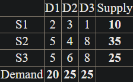
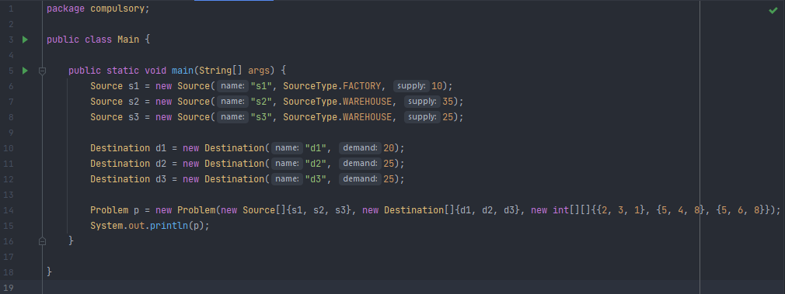
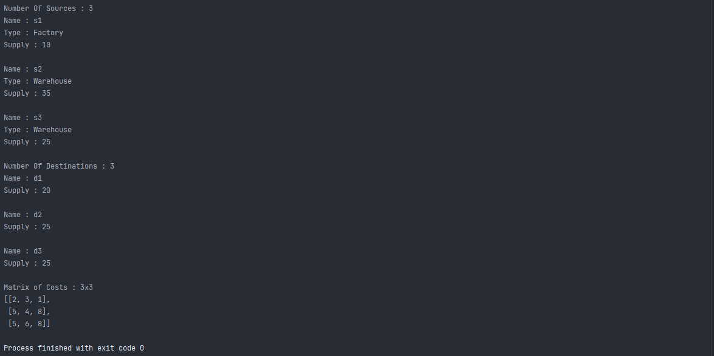

# README

# Advanced Programming - Lab 2

This repository contains all the problems proposed for the second laboratory in Advanced Programming course
solved by me.

## Essential tools

You need to have Java RE or JDK >= 8 installed on your computer.

## How to run it?

1. Open project with IntelliJ IDEA

Clone this repository and open it with IntelliJ IDEA. Build this project
(shortcut Ctrl+F9) then go to Run->Run...(shortcut Alt+Shift+F10) and select
the file you want to run.

2. Compile and run the programs using CMD

Go to the folder where the file is located. Open a new terminal here.

If you want to compile the file the file Main.java you must type the command.

```bash
javac -d . Main.java
```

After you compiled it, if you want to start the program you can type the
following command

```bash
java packageName.Main
```

where to packageName is the name of the package which includes the file Main.java.

## Problem

### The Transportation Problem
An instance of the Transportation Problem consists of source and destinations.

- Each source has a given capacity, i.e. how many units of a commodity it is able to supply to the destinations.
- Each destination demands a certain amount of commodities.
- The cost of transporting a unit of commodity from each source to each destination is given by a cost matrix (or function).

We consider the problem of determining the quantities to be transported from sources to destinations, in order to minimize the total transportation cost. The supply and demand constraints must be satisfied. (We may assume that all the values are integer).

Consider the following example.



A solution may be something like that:

- S1 -> D3: 10 units * cost 1 = 10
- S2 -> D2: 25 units * cost 4 = 100
- S2 -> D3: 10*8 = 80
- S3 -> D1: 20*5 = 100
- S3 -> D3: 5*8 = 40

Total cost: 330

## Tasks

### Compulsory

- [x] Create an object-oriented model of the problem. You should have (at least) the following classes: Source, Destination, Problem.
- [x] The sources and the destinations have names. The sources will also have the property type. The available types will be implemented as an enum . For example:
```java
public enum SourceType {
WAREHOUSE, FACTORY;
}
```
Assume S1 is a factory and S2, S3 are warehouses.
- [x] Each class should have appropriate constructors, getters and setters.
Use the IDE features for code generation, such as generating getters and setters.
- [x] The toString method form the Object class must be properly overridden for all the classes.
Use the IDE features for code generation, for example (in NetBeans) press Alt+Ins or invoke the context menu, select "Insert Code" and then "toString()" (or simply start typing "toString" and then press Ctrl+Space).
- [x] Create and print on the screen the instance of the problem described in the example.

#### Exemple

Input : 3 sources(1 FACTORY AND 2 WAREHOUSES), 3 destinations and the cost matrix described in the example



Output : this program outputs the details of the problem



### Optional

To be continued...

### Bonus

To be continued...
